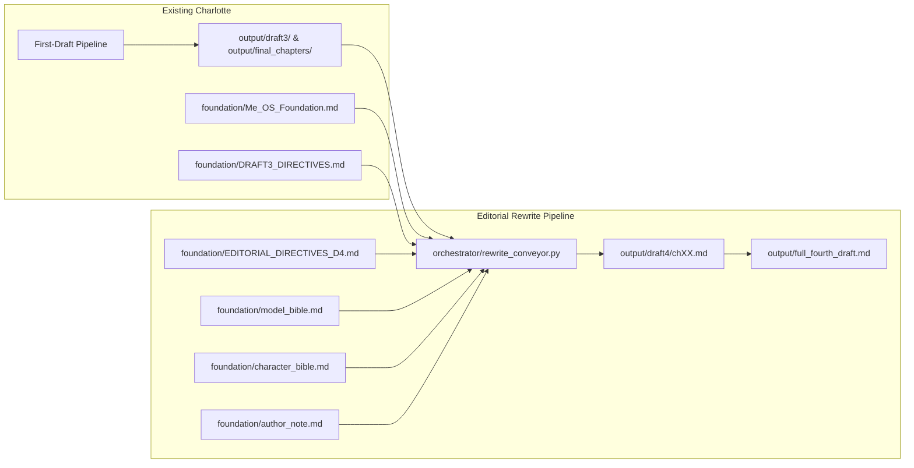
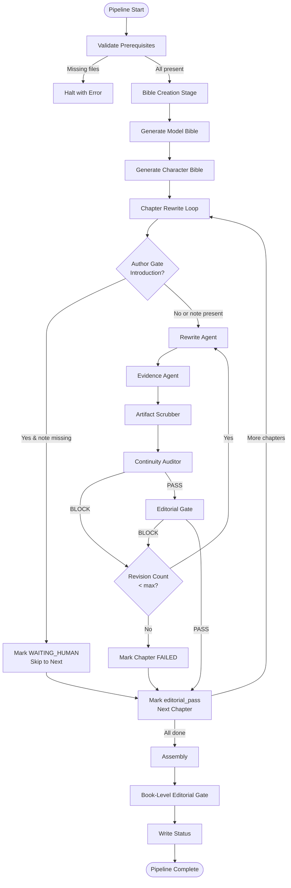

# Design Document: Editorial Rewrite Pipeline

## Overview

The Editorial Rewrite Pipeline is a new stage in the Charlotte Book Factory that transforms Draft 3 into Draft 4 by systematically applying consolidated professional editorial feedback. It extends — but does not replace — the existing first-draft pipeline.

### Design Principles

1. **Additive extension** — The new pipeline reuses the same architectural primitives (ModelClient, Ledger, BookState, handoff contract, agent definitions) without modifying any existing stage.
2. **File-driven, agent-agnostic** — Like the first-draft workflow, state lives in the repo, not chat memory. Any executor can run it.
3. **Fail-safe for human content** — The Author Gate halts processing where human-written material is required rather than fabricating it.
4. **Resumable** — Partial runs are recoverable; passing chapters are never re-processed.
5. **Contract-verified** — Each chapter passes two independent gates (existing Chapter Acceptance Gate + new Editorial Gate) before approval.

### Key Decisions

| Decision | Rationale |
|----------|-----------|
| Separate orchestrator module (`orchestrator/rewrite_conveyor.py`) | Keeps first-draft pipeline untouched; avoids flag proliferation in run.py |
| Model Bible and Character Bible as foundation files | They are reference documents consumed by every rewrite agent, analogous to `Me_OS_Foundation.md` |
| State in `output/draft4_state.json` (separate from `book_state.json`) | Draft 4 state is independent; allows both pipelines to coexist |
| Revision loop capped at `editorial_rewrite.max_revisions` (default 3) | Matches the existing pattern; prevents infinite loops on unfixable gate failures |
| `[AUTHOR VOICE]` markers instead of fabricated content | Non-negotiable safety rule from the existing foundation |
| Evidence Agent as separate stage (not merged into Rewrite Agent) | Separation of concerns: rewriting is creative; sourcing is factual verification. Different failure modes, different revision strategies. |
| Word count target is EXPANSION not reduction | Both editors said 25k is too short; target 35k. The Rewrite Agent cuts duplication AND adds depth simultaneously. |
| [NOTE TO AUTHOR] consolidated into author_actions.md | Single searchable artefact for all human-dependent work, so the author doesn't miss any. |

---

## Architecture

The editorial rewrite pipeline sits downstream of the first-draft pipeline and consumes its output. It introduces new agents, a new workflow file, new foundation documents (bibles), and a new orchestrator module.

### System Context



### Pipeline Sequence



### Integration with Existing Architecture

| Aspect | How It Integrates |
|--------|-------------------|
| **Orchestrator** | New module `orchestrator/rewrite_conveyor.py` imports from `orchestrator.ledger`, `orchestrator.book_state`, `providers.model_client` — same as `run.py` |
| **Config** | New `editorial_rewrite` section in `config.yaml`; existing sections unchanged |
| **Agents** | New agent definition files in `agents/`; existing agents untouched |
| **Foundation** | New files in `foundation/`; existing foundation and directives remain authoritative |
| **Output** | New `output/draft4/` directory; existing `output/` untouched |
| **Contracts** | Handoff contract gains a new "Rewrite Stage" section; existing entries unchanged |
| **Quality** | Both the existing Chapter Acceptance Gate and new Editorial Gate must pass independently |

---

## Components and Interfaces

### Component 1: Rewrite Conveyor (`orchestrator/rewrite_conveyor.py`)

**Purpose:** The main orchestrator module for the editorial rewrite pipeline. Analogous to `run.py` for the first-draft pipeline.

**Interface:**

```python
def main() -> None:
    """Entry point. Parses CLI args, loads config, runs the rewrite pipeline."""

# CLI arguments:
#   --chapter N        Process only chapter N
#   --bibles-only      Generate bibles and stop
#   --assemble-only    Assemble existing draft4 chapters
#   --no-resume        Ignore state file, reprocess all chapters
```

**Internal functions (following existing patterns):**

```python
def validate_prerequisites(cfg: dict) -> None:
    """Check EDITORIAL_DIRECTIVES_D4, Model Bible, Character Bible exist. Halt on missing."""

def generate_model_bible(cfg: dict, client: ModelClient, ledger: Ledger) -> str:
    """Produce foundation/model_bible.md from Foundation + DRAFT3_DIRECTIVES + ED4."""

def generate_character_bible(cfg: dict, client: ModelClient, ledger: Ledger) -> str:
    """Produce foundation/character_bible.md from Foundation + Model Bible + ED4."""

def check_author_gate(chapter_number: int) -> Tuple[bool, str]:
    """Return (blocked, reason). Blocked if Introduction and author_note.md insufficient."""

def run_rewrite_chapter(
    cfg: dict, client: ModelClient, ledger: Ledger,
    chapter: Dict, state: RewriteState,
    model_bible: str, character_bible: str,
    directives_d4: str, directives_d3: str,
    foundation: str, prev_d4: str,
) -> str:
    """Run full chapter pipeline: rewrite → evidence → scrub → audit → gate → revision loop."""

def assemble_draft4(cfg: dict, state: RewriteState) -> str:
    """Stitch passing chapters into output/full_fourth_draft.md."""

def run_book_level_editorial_gate(cfg: dict, client: ModelClient, ledger: Ledger, manuscript: str) -> str:
    """Book-level compliance check after assembly."""
```

**Dependencies:** `ModelClient`, `Ledger`, `RewriteState`, agent definition files.

---

### Component 2: Rewrite State (`orchestrator/rewrite_state.py`)

**Purpose:** Track per-chapter progress for the editorial rewrite pipeline, analogous to `BookState` but tailored for the rewrite workflow.

**Interface:**

```python
@dataclass
class RewriteChapterRecord:
    number: int
    title: str
    status: str  # "pending" | "rewriting" | "rewritten" | "editorial_pass" | "blocked" | "waiting_human_input"
    revision_count: int = 0
    block_reason: str = ""
    blocking_agent: str = ""
    d3_word_count: int = 0
    d4_word_count: int = 0
    characters_used: List[str] = field(default_factory=list)
    output_path: str = ""

@dataclass  
class RewriteState:
    chapters: List[RewriteChapterRecord]
    
    def get(self, number: int) -> Optional[RewriteChapterRecord]
    def upsert(self, record: RewriteChapterRecord) -> None
    def is_editorial_pass(self, number: int) -> bool
    def save(self, path: Path) -> None
    def load(cls, path: Path) -> "RewriteState"
    def summary_status(self) -> Dict[str, int]  # counts per status category
```

**Persistence:** JSON at `output/draft4_state.json`. Written within 5 seconds of any status change (immediate write after each transition, matching existing `BookState.save()` pattern).

---

### Component 3: Rewrite Agent (`agents/rewrite_agent.md`)

**Purpose:** Transform a single Draft 3 chapter into a Draft 4 chapter applying all editorial directives.

**Inputs (declared in agent file):**
- Draft 3 chapter text
- Model Bible
- Character Bible
- Editorial_Directives_D4
- DRAFT3_DIRECTIVES
- Foundation
- Preceding Draft 4 chapter (or Foundation alone for Chapter 0)

**Output:** Rewritten chapter + appended rewrite log containing:
- Changes mapped to directives
- Word count before/after
- Characters used
- Unresolved issues

---

### Component 4: Evidence Agent (`agents/evidence_agent.md`)

**Purpose:** Scan rewritten chapters for unsourced psychological, neurological, behavioural, and health-related claims; insert source references or qualifying phrases; flag unfixable claims with `[NOTE TO AUTHOR]` markers.

**Input:** Rewritten chapter from Rewrite Agent (`output/draft4/chXX_raw.md`).

**Processing logic:**
1. Identify claims that are psychological, neurological, behavioural, or health-related and currently lack a source reference or qualifying phrase
2. For each unsourced claim, either:
   - Insert a lightweight inline reference to an established, well-known source (e.g., endnote), or
   - Add a qualifying phrase honestly positioning the claim as synthesis (e.g., "in my model…", "as a practical rule…")
3. If a claim cannot be sourced or qualified without fundamentally changing its meaning, insert a `[NOTE TO AUTHOR: SOURCE_NEEDED — <specific claim text>]` marker

**Constraints:**
- SHALL NOT invent citations, fabricate study names, or attribute claims to specific researchers without verification
- References must be to established, well-known findings only

**Output:**
- Evidenced chapter: `output/draft4/chXX_evidenced.md`
- Evidence log (appended or co-located) listing: claims found, action per claim (sourced / qualified / flagged for author), and reference or qualifier added

**Passes output to:** Artifact Scrubber (replaces raw rewrite in pipeline sequence)

---

### Component 5: Artifact Scrubber (`agents/artifact_scrubber.md`)

**Purpose:** Detect and remove production artifacts from rewritten chapters.

**Input:** Evidenced chapter text (output of Evidence Agent).

**Artifact patterns scanned:**
1. Literal `EDITOR FLAG`
2. `[Author's note]` placeholders (preserved in Introduction, removed elsewhere)
3. Outline headers matching `## <phrase> purpose:`
4. Misnumbered chapter references
5. Internal YAML/code blocks with workflow keys

**Output:** Clean chapter + artifact removal log.

---

### Component 6: Continuity Auditor (`agents/continuity_auditor.md`)

**Purpose:** Verify rewritten chapters are consistent with Model Bible and Character Bible.

**Checks:**
1. Character existence — every named character is in the Character Bible
2. Layer/currency name matching — case-sensitive exact match to Model Bible
3. Character detail consistency — no contradictions with Bible entries
4. Reveal-order compliance — no premature appearances

**Output:** PASS or BLOCK with violation list.

---

### Component 7: Editorial Gate (`agents/editorial_gate.md`)

**Purpose:** Quality gate verifying compliance with editorial directives.

**Per-chapter checks:**
- (a) Character cast compliance
- (b) Artifact-free status
- (c) Word count within per-chapter target range (from Editorial_Directives_D4 target table — **supersedes** the previous flat 15–25% reduction check per Req 14.6)
- (d) Layer terminology matches Model Bible
- (e) Exercise variety (no more than 2 consecutive same-format)
- (f) Factual claims have source references

**Book-level checks (post-assembly):**
- Total word count within 33,000–37,000 range (Req 14.5 — **supersedes** the previous 15–25% total reduction check)
- Character frequency distribution per Character Bible
- No residual placeholders across entire manuscript

**Output:** PASS or BLOCK with per-check details and locations.

---

### Component 8: Author Gate (logic in rewrite_conveyor.py)

**Purpose:** Halt the Introduction chapter rewrite until human-supplied author content is available.

**Logic (implemented in orchestrator, not as a separate agent):**

```python
def check_author_gate(chapter_number: int) -> Tuple[bool, str]:
    """
    Returns (blocked: bool, reason: str).
    Only blocks chapter 0 (Introduction).
    Checks foundation/author_note.md:
      - File must exist
      - Must contain >= 50 words of non-boilerplate content
      - Boilerplate patterns: "Insert your note here", "TODO", "Replace this"
    """
```

**Behaviour when blocked:**
- Chapter status → `"waiting_human_input"`
- Pipeline continues with all other chapters
- On re-run with `resume: true`, rechecks the gate; unblocks if satisfied

---

### Component 9: Workflow Definition (`workflows/editorial-rewrite-workflow.md`)

**Purpose:** Human-readable workflow definition following the same conventions as `first-draft-workflow.md`.

**Structure:**
- Goal and input/output declarations
- Stage sequence with ordering
- Per-stage agent assignments
- Trigger/exit conditions
- Resume rules
- Quality gates

**Pipeline Sequence (updated for Req 14–18):** Bible Creation (Model Bible, Character Bible) → Chapter Rewrite Loop (Rewrite Agent → Evidence Agent → Artifact Scrubber → Continuity Auditor → Editorial Gate → Revision loop on BLOCK) → Assembly → Author Action Log generation → Book-level Editorial Gate.

---

## Data Models

### 1. Rewrite State (`output/draft4_state.json`)

```json
{
  "chapters": [
    {
      "number": 0,
      "title": "A Note Before We Start",
      "status": "waiting_human_input",
      "revision_count": 0,
      "block_reason": "Author note file missing or insufficient (< 50 words non-boilerplate)",
      "blocking_agent": "author_gate",
      "d3_word_count": 920,
      "d4_word_count": 0,
      "characters_used": [],
      "output_path": ""
    },
    {
      "number": 1,
      "title": "The Doorway — You Are a System",
      "status": "editorial_pass",
      "revision_count": 1,
      "block_reason": "",
      "blocking_agent": "",
      "d3_word_count": 1450,
      "d4_word_count": 1160,
      "characters_used": ["Marcus", "Elena", "Priya", "Tom"],
      "output_path": "output/draft4/ch01.md"
    }
  ]
}
```

### 2. Model Bible (`foundation/model_bible.md`)

```markdown
# Model Bible — THE SYSTEM OF YOU

## Layer: Body
- **Definition:** (max 30 words)
- **Includes:** ...
- **Excludes:** ...
- **Diagnostic test:** "Is this sensation purely physical — felt without interpretation?"
- **Commonly confused with:** Wiring (speed vs. weight), Room (external vs. internal temperature)

## Layer: Wiring
...

## Currency: Charge
- **Definition:** (max 30 words)
- **Manifestation per layer:** Body: ..., Wiring: ..., Habit: ..., Room: ..., Story: ...
- **Differs from Fuel:** ...
- **Differs from Pressure:** ...

## Diagnostic Sequence
- Recommended evaluation order: Body → Wiring → Habit → Room → Story
- Feedback loops: Room → Body (environmental stressors), Story → Habit (narrative reinforcing loops)

## Wiring-vs-Story Discrimination
- Q1: "Did the response happen before conscious thought?" → Wiring
- Q2: "Is there a sentence (narrative) attached to the experience?" → Story
```

### 3. Character Bible (`foundation/character_bible.md`)

```markdown
# Character Bible — THE SYSTEM OF YOU

## Cast

### [Character 1 Name]
- **Age:** 
- **Occupation:** 
- **Situation:** 
- **Primary layer:** Body
- **Secondary layer:** —
- **Physical signature:** (one concrete sensory detail)
- **What they carry:** (one sentence)

...

## Chapter Appearance Map

| Character | Ch0 | Ch1 | Ch2 | Ch3 | Ch4 | Ch5 | Ch6 | Ch7 | Ch8 | Ch9 | Ch10 | Ch11 | Ch12 |
|-----------|-----|-----|-----|-----|-----|-----|-----|-----|-----|-----|------|------|------|
| [Char 1]  | —   | P   | P   | —   | —   | S   | —   | —   | S   | —   | —    | —    | S    |

P = Primary, S = Secondary, — = absent

## Distribution Check
- No character > 40% of chapter-level appearances
```

### 4. Editorial Directives D4 (`foundation/EDITORIAL_DIRECTIVES_D4.md`)

Required sections:
1. Character Consolidation Rules
2. Repetition-Reduction Targets
3. Production-Artifact Definitions
4. Author-Presence Insertion Points (6–8 across book)
5. Sourcing Requirements
6. Layer-Boundary Clarifications
7. Taxonomy-Reframing Guidance

### 5. Rewrite Log (appended to each chapter output)

```markdown
---
## Rewrite Log

### Changes Applied
| Change | Directive |
|--------|-----------|
| Replaced "Sarah" with "Elena" (Character Bible) | Character Consolidation §2 |
| Removed EDITOR FLAG on line 42 | Production-Artifact Definitions §1 |
| Added source ref for HPA axis claim | Sourcing Requirements §3 |

### Metrics
- **Draft 3 word count:** 2,200
- **Draft 4 word count:** 1,780 (reduction: 19.1%)

### Characters Used
- Elena (primary), Marcus (secondary)

### Unresolved Issues
- Line 88: Claim about cortisol half-life — no accessible source found. Flagged for author.
```

### 6. Artifact Removal Log

```markdown
## Artifact Removal Log — Ch02

| # | Type | Line | Snippet | Action |
|---|------|------|---------|--------|
| 1 | EDITOR FLAG | 34 | `<!-- EDITOR FLAG: check sourcing -->` | Removed |
| 2 | Outline header | 12 | `## Section Three purpose: introduce...` | Removed |

**Total artifacts found:** 2
**Total removed:** 2
**Total preserved:** 0
```

### 7. Config Extension (`config.yaml` additions)

```yaml
editorial_rewrite:
  max_revisions: 3
  word_reduction_target_min: 0.15
  word_reduction_target_max: 0.25
  run_artifact_scrubber: true
  run_continuity_auditor: true
  run_editorial_gate: true
  resume: false
  agents:
    rewrite_agent: "agents/rewrite_agent.md"
    artifact_scrubber: "agents/artifact_scrubber.md"
    continuity_auditor: "agents/continuity_auditor.md"
    evidence_agent: "agents/evidence_agent.md"

book:
  title: "THE SYSTEM OF YOU"
  foundation_file: "foundation/Me_OS_Foundation.md"
  output_file: "output/full_second_draft.md"
  output_file_d4: "output/full_fourth_draft.md"
```

### 8. Handoff Contract Extension

New entries for the rewrite stage section:

| Stage | Producing Agent | Consuming Agent(s) | Output Path Pattern |
|-------|----------------|--------------------|--------------------|
| Model Bible | Bible Generator | Rewrite Agent, Continuity Auditor, Editorial Gate | `foundation/model_bible.md` |
| Character Bible | Bible Generator | Rewrite Agent, Continuity Auditor, Editorial Gate | `foundation/character_bible.md` |
| Chapter Rewrite | Rewrite Agent | Evidence Agent | `output/draft4/chXX_raw.md` |
| Evidenced Chapter | Evidence Agent | Artifact Scrubber | `output/draft4/chXX_evidenced.md` |
| Evidence Log | Evidence Agent | Editorial Gate, Author Action Log | `output/draft4/chXX_evidence_log.md` |
| Scrubbed Chapter | Artifact Scrubber | Continuity Auditor | `output/draft4/chXX_scrubbed.md` |
| Continuity Report | Continuity Auditor | Rewrite Agent (on BLOCK) | `output/reviews/chXX_continuity_d4.md` |
| Editorial Report | Editorial Gate | Rewrite Agent (on BLOCK) | `output/reviews/chXX_editorial_d4.md` |
| Final D4 Chapter | Pipeline | Assembler | `output/draft4/chXX.md` |
| Assembled Draft 4 | Assembler | Book-level Editorial Gate | `output/full_fourth_draft.md` |
| Author Action Log | Pipeline (post-assembly) | Author | `output/author_actions.md` |

Package fields for rewrite stage entries:
```yaml
book_id: charlotte
stage: rewrite
chapter_number: <int>
input_files: [...]
output_file: <path>
status: PENDING | IN_PROGRESS | COMPLETE | FAILED | WAITING_HUMAN
next_agent: <agent_name>
```

### 9. Status File (`output/status_d4.md`)

```markdown
# Charlotte Draft 4 — Status

## Summary
- Total chapters: 13
- editorial_pass: 10
- blocked: 1
- waiting_human_input: 1
- pending: 1

## Blocked Chapters
- Ch07: The Method Made Whole — BLOCKED by editorial_gate (word reduction only 12%, below 15% target)

## Waiting Human Input
- Ch00: A Note Before We Start — WAITING (author_note.md missing)
```

### 10. Evidence Log (`output/draft4/chXX_evidence_log.md`)

```markdown
## Evidence Log — Ch03

| # | Claim | Action | Reference / Qualifier Added |
|---|-------|--------|----------------------------|
| 1 | "Cortisol levels spike within 3 minutes of a perceived threat" | sourced | Endnote: Sapolsky, R. (2004) — HPA axis activation timeline is well-established |
| 2 | "The body remembers trauma even when the mind forgets" | qualified | Inserted: "as van der Kolk and others have argued…" |
| 3 | "80% of serotonin is produced in the gut" | sourced | Endnote: Yano et al. (2015) — widely cited gut-brain axis finding |
| 4 | "Narrative therapy rewires neural pathways within 6 weeks" | flagged for author | [NOTE TO AUTHOR: SOURCE_NEEDED — no well-known study supports this specific timeframe] |

**Summary:**
- Claims scanned: 12
- Sourced: 6
- Qualified: 4
- Flagged for author: 2
```

### 11. Author Action Log (`output/author_actions.md`)

```markdown
# Author Action Log — Draft 4

All points in the manuscript requiring human author input. Search for `[NOTE TO AUTHOR` to locate each in context.

| # | Chapter | Location | Category | Explanation |
|---|---------|----------|----------|-------------|
| 1 | Ch00 (Introduction) | Para 1 | PERSONAL_STORY | Your personal story is the credibility anchor for the entire book. Write 200–500 words about: where this model came from, one real before-and-after, and who you've watched it help. |
| 2 | Ch03 | §Body Signals | VOICE_MOMENT | A brief personal anecdote showing your own experience of misreading body signals. 50–100 words. |
| 3 | Ch03 | §HPA claim (line 84) | SOURCE_NEEDED | "Narrative therapy rewires neural pathways within 6 weeks" — no established source supports this specific timeframe. Provide personal experience, a general research reference, or reframe as synthesis. |
| 4 | Ch07 | §Method summary | DECISION_NEEDED | The "five-step method" naming conflicts with an existing trademarked programme. Choose an alternative name or confirm intent. |

**Total markers:** 4
**By category:** PERSONAL_STORY: 1, VOICE_MOMENT: 1, SOURCE_NEEDED: 1, DECISION_NEEDED: 1
```

### 12. Per-Chapter Word Count Target Table (in Editorial_Directives_D4)

```markdown
## Per-Chapter Word Count Targets — Draft 4

The Rewrite Agent and Editorial Gate use this table instead of a flat percentage reduction.
Total target: 33,000–37,000 words.

| Chapter | D3 Word Count | D4 Target Min | D4 Target Max | Notes |
|---------|--------------|---------------|---------------|-------|
| Ch00    | 920          | 1,000         | 1,400         | Expansion: author note adds bulk |
| Ch01    | 1,450        | 2,200         | 2,800         | Expansion: mechanism explanations |
| Ch02    | 2,100        | 2,600         | 3,200         | Add failure modes |
| Ch03    | 2,200        | 2,800         | 3,400         | Add hard cases, counterexamples |
| Ch04    | 1,800        | 2,400         | 3,000         | Expansion: model limitations |
| Ch05    | 2,300        | 2,600         | 3,200         | Light expansion + de-dup |
| Ch06    | 2,100        | 2,600         | 3,200         | Add failure modes |
| Ch07    | 2,400        | 2,800         | 3,400         | Add mechanism depth |
| Ch08    | 1,900        | 2,400         | 3,000         | Expansion: counterexamples |
| Ch09    | 2,200        | 3,000         | 3,600         | Significant expansion: constraint taxonomy |
| Ch10    | 1,800        | 2,400         | 2,800         | Faith/trust paragraph + depth |
| Ch11    | 2,100        | 2,600         | 3,200         | Add hard cases |
| Ch12    | 1,700        | 2,200         | 2,800         | Closing expansion |
| **Total** | **~25,000** | **~33,600** | **~37,000** | |

The Editorial Gate per-chapter check validates against this table (Req 14.6), superseding the previous flat 15–25% reduction check.
```

---

## Correctness Properties

*A property is a characteristic or behavior that should hold true across all valid executions of a system — essentially, a formal statement about what the system should do. Properties serve as the bridge between human-readable specifications and machine-verifiable correctness guarantees.*

### Property 1: Directive Hierarchy Resolution

*For any* chapter containing a term or instruction addressed by both `EDITORIAL_DIRECTIVES_D4` and `DRAFT3_DIRECTIVES` with conflicting guidance, the pipeline output SHALL reflect only the `EDITORIAL_DIRECTIVES_D4` instruction for that term.

**Validates: Requirements 1.3, 4.9**

### Property 2: Character Cast Closure

*For any* rewritten chapter, the set of named characters appearing in the chapter text SHALL be a subset of the character names defined in the Character Bible.

**Validates: Requirements 3.6, 4.2, 6.1**

### Property 3: Layer Terminology Consistency

*For any* rewritten chapter, every occurrence of a layer name or currency name SHALL be a case-sensitive exact match to an entry in the Model Bible, with no synonyms or ad-hoc variants.

**Validates: Requirements 2.6, 4.4, 6.2**

### Property 4: Per-Chapter Word Count Compliance

*For any* rewritten chapter, the Draft 4 word count SHALL fall within the per-chapter target range specified in the Editorial_Directives_D4 word count target table.

> **Note (Req 14.6 superseding change):** This property replaces the original flat 15–25% reduction formula (`D3_count * (1 - max_reduction) <= D4_count <= D3_count * (1 - min_reduction)`). The new pipeline targets word count **expansion** to ~35,000 total words, with per-chapter targets set individually in Editorial_Directives_D4.

**Validates: Requirements 14.6, 7.1c (superseded)**

### Property 5: Artifact-Free Output

*For any* chapter that has passed the Artifact Scrubber, the output text SHALL contain zero instances of the defined production artifact patterns (EDITOR FLAG, outline headers matching `## <phrase> purpose:`, workflow YAML blocks, misnumbered chapter references), except `[Author's note]` in the Introduction when explicitly preserved.

**Validates: Requirements 5.1, 5.4, 7.1**

### Property 6: Continuity Auditor Round-Trip

*For any* chapter that the Continuity Auditor marks as PASS, re-running the auditor on that chapter with the same Model Bible and Character Bible SHALL produce PASS again (idempotence of the audit).

**Validates: Requirements 6.5, 6.6**

### Property 7: Author Gate Blocking Condition

*For any* invocation of the Author Gate on the Introduction chapter, the gate SHALL return BLOCK if and only if `foundation/author_note.md` does not exist OR contains fewer than 50 words of non-boilerplate content.

**Validates: Requirements 8.1, 8.2, 8.3**

### Property 8: Resume Skips Passing Chapters

*For any* pipeline re-run with `resume: true`, chapters with status `"editorial_pass"` in the state file SHALL not be reprocessed, and their output files SHALL remain unchanged.

**Validates: Requirements 9.4, 13.2**

### Property 9: State File Reflects All Transitions

*For any* chapter status change during pipeline execution, the state file (`output/draft4_state.json`) SHALL be updated to reflect the new status before the pipeline proceeds to the next operation on a different chapter.

**Validates: Requirements 13.1, 13.5**

### Property 10: Revision Loop Termination

*For any* chapter entering the revision loop, the number of revision iterations SHALL not exceed `editorial_rewrite.max_revisions` (from config.yaml, default 3). If the maximum is reached with a BLOCK verdict, the chapter SHALL be marked as `"blocked"` in the state file.

**Validates: Requirements 9.5, 9.6**

### Property 11: Word Count Expansion

*For any* completed pipeline run, the assembled Draft 4 manuscript word count SHALL fall within 33,000–37,000 words.

**Validates: Requirements 14.1, 14.5**

### Property 12: Evidence Agent Non-Fabrication

*For any* source reference inserted by the Evidence Agent, the reference SHALL be to an established, well-known finding (not a fabricated citation). The Evidence Agent SHALL NOT invent study names, attribute claims to specific researchers without verification, or generate fictitious publication details.

**Validates: Requirements 15.3, 15.4**

### Property 13: Constraint Taxonomy Completeness

*For any* Draft 4 version of Chapter 9, the chapter SHALL contain all 5 constraint categories defined in Editorial_Directives_D4: immutable constraint, currently constrained, externally imposed constraint, changeable-but-costly constraint, and unsafe situation.

**Validates: Requirements 16.1, 16.4**

### Property 14: Author Marker Consistency

*For any* `[NOTE TO AUTHOR]` marker present in the Draft 4 manuscript, the marker SHALL follow the format `[NOTE TO AUTHOR: <CATEGORY> — <explanation>]` where CATEGORY ∈ {PERSONAL_STORY, VOICE_MOMENT, SOURCE_NEEDED, DECISION_NEEDED}.

**Validates: Requirements 18.4**

---

## Error Handling

### Prerequisite Validation Errors

| Condition | Behaviour |
|-----------|-----------|
| `EDITORIAL_DIRECTIVES_D4.md` missing | Pipeline halts with clear error naming the missing file |
| `EDITORIAL_DIRECTIVES_D4.md` missing required sections | Pipeline halts identifying absent sections |
| `model_bible.md` missing when chapter rewrite starts | Pipeline halts (should have been generated in Bible stage) |
| `character_bible.md` missing when chapter rewrite starts | Pipeline halts |
| Draft 3 chapter file missing for a queued chapter | Chapter marked `"blocked"` with reason; pipeline continues to next |

### Runtime Errors

| Condition | Behaviour |
|-----------|-----------|
| Model API timeout or 5xx | Retry with exponential backoff (30s, 60s, 90s, 120s, 180s) — same pattern as `conveyor_v3.py` |
| Model API 429 (rate limit) | Wait and retry per backoff schedule |
| State file corrupted (unparseable JSON) | Pipeline halts with error; does NOT overwrite the file |
| State file missing on resume | Treat all chapters as `"pending"` |
| Author Gate blocks Introduction | Log block event, continue all other chapters |
| Revision loop exhausted | Mark chapter `"blocked"`, log shortfall, continue |
| Word reduction < 15% achievable | Rewrite Agent logs justification; Editorial Gate may still BLOCK |

### Conflict Resolution

| Conflict | Resolution |
|----------|-----------|
| ED4 vs DRAFT3_DIRECTIVES | ED4 wins; conflict logged in rewrite log |
| Continuity Auditor BLOCK + Editorial Gate PASS | Chapter still blocked (both must PASS) |
| Character not in Bible but required by narrative | Use unnamed role-described figure (max 2 per chapter) |
| Unresolvable source for claim | Flag for author review in rewrite log |

---

## Testing Strategy

### Assessment: Property-Based Testing Applicability

PBT **is appropriate** for this feature because:
- The pipeline has pure logic components with clear input/output (state transitions, validation functions, file parsing)
- Universal properties hold across all valid chapters (character closure, terminology matching, word count bounds)
- The input space is large (13 chapters × varying content)
- Functions like `check_author_gate`, state management, and artifact detection have deterministic, testable behaviour

### Dual Testing Approach

#### Property-Based Tests (using Hypothesis for Python)

Each correctness property from the design maps to a property-based test:

- **Tag format:** `Feature: editorial-rewrite-pipeline, Property {N}: {title}`
- **Minimum iterations:** 100 per property
- **Library:** [Hypothesis](https://hypothesis.readthedocs.io/) (Python PBT framework)

| Property | Test Strategy |
|----------|--------------|
| 1 (Directive Hierarchy) | Generate random chapter text with conflicting directive terms; verify output matches ED4 |
| 2 (Character Cast Closure) | Generate random chapter text with character names; verify all names ∈ Character Bible set |
| 3 (Layer Terminology) | Generate random text with layer/currency references; verify case-sensitive match to Bible |
| 4 (Per-Chapter Word Count) | Generate chapters of varying length; verify output satisfies per-chapter target bounds from ED4 table |
| 5 (Artifact-Free) | Generate chapters with randomly inserted artifacts; verify scrubber removes all |
| 6 (Continuity Idempotence) | Generate passing chapters; verify re-audit still passes |
| 7 (Author Gate) | Generate `author_note.md` content of varying length/boilerplate; verify block decision |
| 8 (Resume Skip) | Generate state files with various status values; verify only non-pass chapters processed |
| 9 (State Transitions) | Generate sequences of status changes; verify state file updated after each |
| 10 (Revision Termination) | Generate chapter runs with BLOCK verdicts; verify loop stops at max_revisions |
| 11 (Word Count Expansion) | Generate full draft assemblies with varying chapter lengths; verify total within 33k–37k |
| 12 (Evidence Non-Fabrication) | Generate chapters with unsourced claims; verify inserted references are from well-known sources (validate against allowlist of established findings) |
| 13 (Constraint Taxonomy Completeness) | Generate Ch9 rewrites with random constraint examples; verify all 5 categories present |
| 14 (Author Marker Consistency) | Generate `[NOTE TO AUTHOR]` markers with random categories/explanations; verify format compliance and category ∈ {PERSONAL_STORY, VOICE_MOMENT, SOURCE_NEEDED, DECISION_NEEDED} |

#### Unit Tests (pytest)

Focus on:
- Config parsing and validation (missing keys → halt)
- State file serialization/deserialization round-trips
- Artifact pattern matching (specific regex patterns)
- Word count calculation accuracy
- Author Gate boilerplate detection logic
- Editorial Gate per-check pass/fail logic with concrete examples
- Rewrite log parsing

#### Integration Tests

Focus on:
- Full chapter pipeline with MockModelClient (validates wiring)
- Resume behaviour across simulated runs
- Assembly of passing chapters into full manuscript
- Book-level Editorial Gate on assembled output
- Error paths (missing files, corrupted state, exhausted revisions)

### Test File Organization

```
tests/
  test_rewrite_state.py        # State model unit + property tests
  test_author_gate.py          # Author Gate logic unit + property tests  
  test_artifact_scrubber.py    # Artifact detection property tests
  test_editorial_gate.py       # Gate check logic
  test_evidence_agent.py       # Evidence Agent non-fabrication + marker format tests
  test_author_markers.py       # [NOTE TO AUTHOR] format consistency property tests
  test_word_count.py           # Per-chapter and total word count target validation
  test_rewrite_conveyor.py     # Integration tests with MockModelClient
  test_config_validation.py    # Config parsing edge cases
```

### CI Integration

- All property-based tests run in CI on every push
- Integration tests use `MockModelClient` (no network, deterministic)
- No live model calls in automated testing
